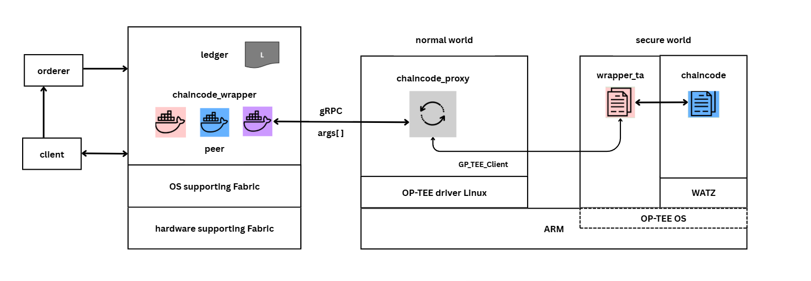
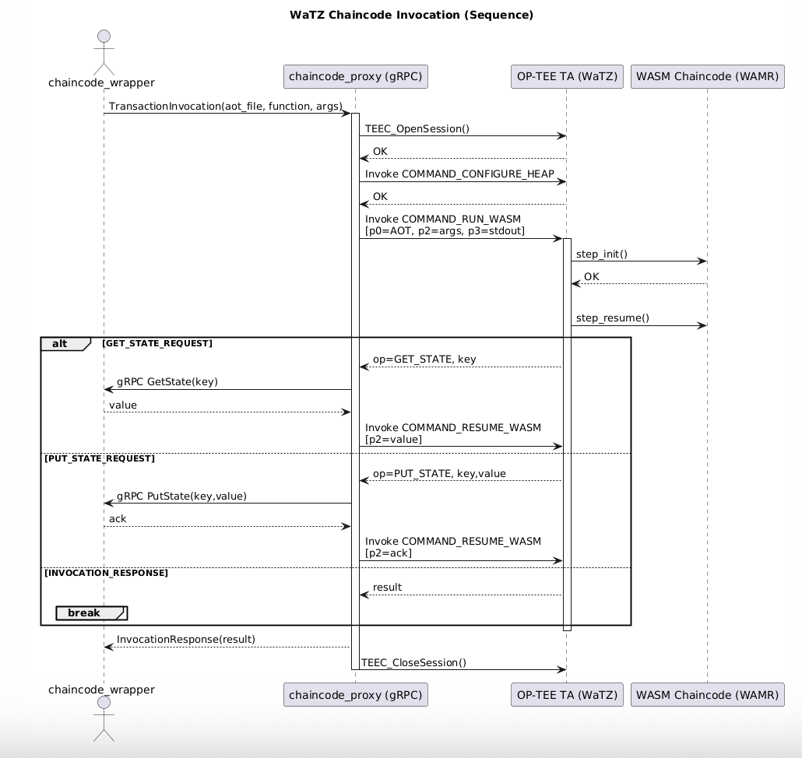

### 1. 프로젝트 소개

본 프로젝트는 신뢰 실행 환경(TEE, Trusted Execution Environment)을 활용한 스마트 컨트랙트 실행 보호 기술입니다.

#### 1-1. 프로젝트 배경

현재 블록체인 기술이 다양한 분야에 적용되면서 스마트 컨트랙트의 보안성에 대한 우려가 증가하고 있습니다. 기존의 블록체인 플랫폼에서는 스마트 컨트랙트가 일반적인 실행 환경에서 동작하기 때문에 다음과 같은 보안 위험에 노출됩니다:

- **코드 노출**: 스마트 컨트랙트 코드가 평문으로 저장되어 악의적인 분석이 가능
- **실행 환경 취약점**: 호스트 시스템의 취약점이 스마트 컨트랙트 실행에 영향
- **사이드 채널 공격**: 실행 과정에서 발생하는 정보 누출 위험
- **데이터 기밀성 부족**: 처리되는 민감한 데이터의 보호 부족

이러한 문제점들을 해결하기 위해 하드웨어 기반의 신뢰 실행 환경(TEE)을 활용한 보안 강화 기술의 필요성이 대두되었습니다.

#### 1-2. 프로젝트 개요

본 프로젝트는 블록체인 스마트 컨트랙트의 보안성을 근본적으로 강화하기 위해 OP-TEE(Open Portable Trusted Execution Environment) 환경에서 WASM(WebAssembly) 체인코드를 안전하게 실행하는 통합 시스템을 구현합니다. 

Hyperledger Fabric 네트워크와 완전히 호환되는 구조를 유지하면서, 체인코드의 실행을 하드웨어 기반의 보안 영역으로 격리함으로써 기존 시스템 대비 획기적인 보안성 향상을 달성합니다.

### 2. 프로젝트 개발
#### 2-1. 개발 목표

**1. 보안성 강화**
- TEE 환경을 통한 체인코드 실행의 완전한 격리
- 하드웨어 기반 암호화를 통한 코드 및 데이터 보호
- 사이드 채널 공격에 대한 저항성 확보

**2. 성능 최적화**
- WAMR AOT(Ahead-of-Time) 컴파일을 통한 실행 성능 향상
- TEE 환경에서의 효율적인 메모리 관리
- 최소한의 오버헤드로 보안 기능 제공

**3. 호환성 보장**
- 기존 Hyperledger Fabric 네트워크와의 완전한 호환성
- 표준 체인코드 인터페이스 지원

#### 2-2. 기대 효과

**보안 측면**
- 하드웨어 기반 보안을 통한 스마트 컨트랙트 실행의 신뢰성 확보
- 코드 및 데이터의 기밀성, 무결성 보장
- 고급 지속 위협(APT) 및 사이드 채널 공격에 대한 방어력 향상

**생태계 측면**
- 기존 Hyperledger Fabric 생태계와의 원활한 통합
- 금융, 헬스케어, 공급망 등 보안이 중요한 분야로의 블록체인 적용 확대
- 차세대 보안 블록체인 플랫폼 기술의 선도적 구현

참고 레포지터리:
- [Tz4Fabric](https://github.com/piachristel/open-source-fabric-optee-chaincode)
- [WaTZ](https://github.com/JamesMenetrey/unine-watz)

### 3. 팀소개
Team 37. TrustForge
- 이준혁, hyuck0323@gmail.com, 프로젝트 개발 총괄
- 이준태, lshht198888@gmail.com, 체인코드 연구
- 위재준, jaejunwi1@gmail.com, 프록시 연구

### 4. 시스템 구성도

본 시스템은 다음과 같은 디자인으로 구성되어 있습니다.

#### 4-1. 구성 요소별 역할

**Building Machine**
- WaTZ 빌드
- TA 컴파일  
- 체인코드 AOT 빌드

**Chaincode_Wrapper**
- Fabric Peer
- Orderer
- chaincode_wrapper

**NXP MCIMX8M-EVK**
- fixed-proxy 실행
- wrapper_ta 실행

#### 4-2. 사용 기술 (기술스택)

**하드웨어 플랫폼**
- **ARM TrustZone**: 하드웨어 기반 보안 영역 제공
- **NXP i.MX 8M**: ARM Cortex-A53 기반 애플리케이션 프로세서
- **OP-TEE**: 오픈소스 Trusted Execution Environment

**WebAssembly 런타임**
- **WAMR (WebAssembly Micro Runtime)**: Intel에서 개발한 경량 WASM 런타임
- **WASI (WebAssembly System Interface)**: WASM 애플리케이션을 위한 시스템 인터페이스

**블록체인 및 분산 시스템**
- **Hyperledger Fabric**: 엔터프라이즈급 블록체인 플랫폼
- **gRPC**: 고성능 RPC 프레임워크
- **Protocol Buffers**: 직렬화 프로토콜

**TA (Trusted Application) 개발**
- **C/C++**: TA 구현 주 언어
- **OP-TEE TA API**: TEE 환경 시스템 호출 인터페이스
- **GlobalPlatform TEE API**: 표준 TEE 애플리케이션 인터페이스
- **ARM Trusted Firmware**: 저수준 보안 펌웨어
- **TEE Internal API**: 암호화, 보안 저장소, 시간 서비스 등

#### 4-3. 주요 구성 요소

**1. wrapper_ta**
- OP-TEE 환경의 TEE에서 WASM 체인코드를 실행
- DB 접근을 위한 네이티브 함수 제공
- WAMR 런타임을 통한 AOT 체인코드 실행

**2. fixed-proxy**
- iMX-EVK 보드에서 실행되는 gRPC 서버
- Fabric에서 오는 Invoke 요청을 받아 TEE로 전달
- 50051 포트에서 리슨

**3. chaincode_wrapper**
- Hyperledger Fabric과 TEE 환경을 연결하는 브리지
- Go로 구현된 체인코드 래퍼

#### 4-4. 시퀀스 다이어그램

### 5. 소개 및 시연 영상

### 6. 설치 및 사용법

본 프로젝트는 여러 인스턴스를 사용하며, 다음과 같은 환경에서 실행됩니다:

#### 6-1. 환경 요구사항
- **Build Machine**: Ubuntu 20.04 LTS
- **Chaincode_Wrapper Machine**: Ubuntu 18.04.6 LTS  
- **NXP MCIMX8M-EVK** (Sandisk Extreme Pro microSD A2 장착)

#### 6-2. 설치 가이드

**[설치 가이드 (INSTALLATION.md)](INSTALLATION.md)**

### 7. 참고 문헌

[1] Christina Müller, Marcus Brandenburger, Christian Cachin, Pascal Felber, Christian Göttel, Valerio Schiavoni, "TZ4Fabric: Executing Smart Contracts with ARM TrustZone", arXiv:2008.11601, 2020. Available: https://arxiv.org/pdf/2008.11601

[2] J. Ménétrey, M. Pasin, P. Felber, and V. Schiavoni, "WATZ: A Trusted WebAssembly Runtime Environment with Remote Attestation for TrustZone," arXiv:2206.08722, 2022. Available: https://arxiv.org/pdf/2206.08722

[3] Hyperledger Fabric Documentation, "Hyperledger Fabric,". Available: https://hyperledger-fabric.readthedocs.io/

[4] OP-TEE Documentation, "OP-TEE - Open Portable Trusted Execution Environment,". Available: https://optee.readthedocs.io/

[5] WebAssembly Community Group, "WebAssembly Specification,". Available: https://webassembly.github.io/spec/

[6] Bytecode Alliance, "WebAssembly Micro Runtime (WAMR)," Available: https://github.com/bytecodealliance/wasm-micro-runtime